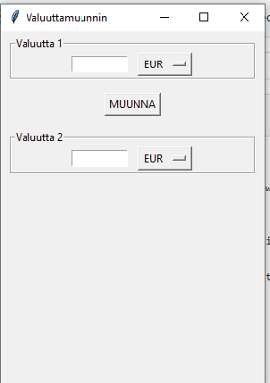

# 💱 Valuuttamuunnin

A simple currency converter built with Tkinter.

## Features
- Convert between multiple currencies
- Easy GUI
- Dropdown menu for currency selection

## How to run

```bash
python main.py
```

